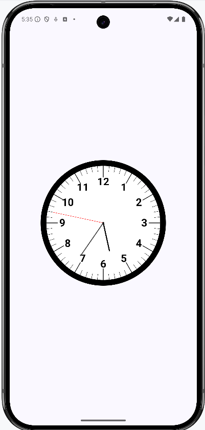

# Analog Clock with Digital Time in Jetpack Compose

This project demonstrates how to create an analog clock with digital time using Jetpack Compose, the modern UI toolkit for Android. It showcases drawing custom graphics with `Canvas`, handling time updates, and using best practices for state management in Compose.

## Features

-   **Analog Clock:** A visually appealing analog clock face with hour, minute, and second hands.
-   **Digital Time:** Displays the current time digitally.
-   **Custom Drawing:** Utilizes Jetpack Compose's `Canvas` to draw the clock face and hands.
-   **Real-time Updates:** The clock hands move in real-time, updating every second.
-   **Clean Code:** Follows Kotlin and Jetpack Compose best practices for readability and maintainability.
-   **Modern Time API**: Uses the modern `java.time` API for handling time.

## Screenshots

## Getting Started

### Prerequisites

-   Android Studio (latest version recommended)
-   Android SDK (API level 26 or higher)
-   Basic knowledge of Kotlin and Jetpack Compose

### Installation

1.  **Clone the repository:**
2.  **Open in Android Studio:**
    - Open Android Studio and select "Open an existing Android Studio project."
    - Navigate to the cloned repository directory and select it.

3.  **Build and Run:**
    - Connect an Android device or start an emulator.
    - Click the "Run" button in Android Studio.

## Usage

The main composable function is `AnalogClockWithDigitalTime()`. You can include it in your Compose 
UI like this:

## Code Structure

-   **`AnalogClockWithDigitalTime.kt`:** Contains the main composable function for the analog clock.
-   **`rememberCurrentTime.kt`:** Contains the composable function for getting the current time.

## Dependencies

-   **Jetpack Compose:**
    -   `androidx.compose.ui:ui`
    -   `androidx.compose.material:material`
    -   `androidx.compose.ui:ui-tooling-preview`
    -   `androidx.compose.ui:ui-graphics`
- **Kotlin Coroutines**:
    - `org.jetbrains.kotlinx:kotlinx-coroutines-android`
- **Android Core KTX**:
    - `androidx.core:core-ktx`

## Contributing

Contributions are welcome! If you'd like to contribute to this project, please follow these steps:

1.  Fork the repository.
2.  Create a new branch for your feature or bug fix.
3.  Make your changes and commit them.
4.  Push your changes to your forked repository.
5.  Submit a pull request.

## License

This project is licensed under the MIT License - see the [LICENSE](LICENSE) file for details.

## Contact

Donald McCaskey - [forteanjo@sky.com](mailto:forteanjo@sky.com)

Project Link: [https://github.com/forteanjo/jetpack_clock](https://github.com/forteanjo/jetpack_clock)
